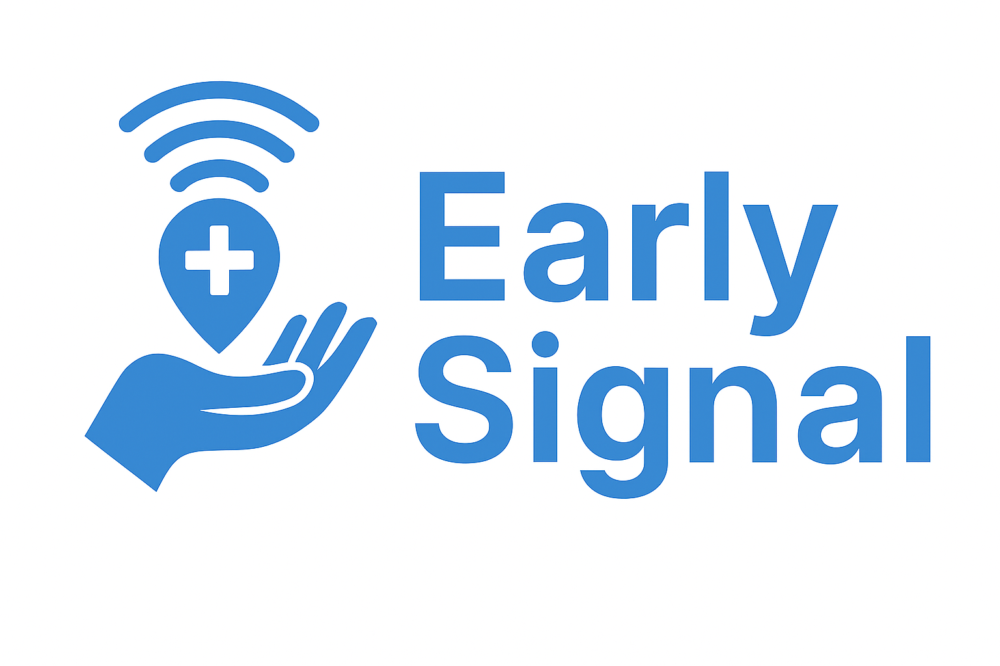
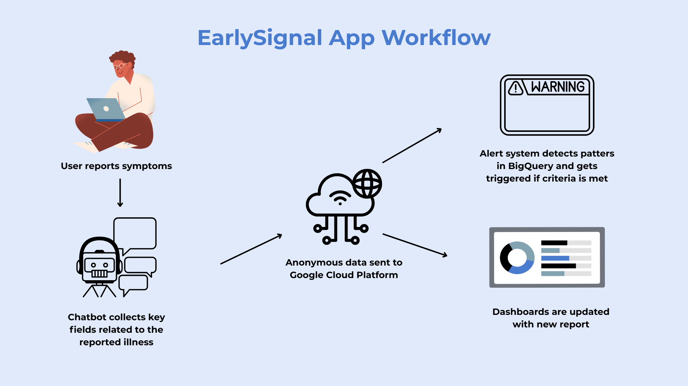

# EarlySignal: Democratizing public health through real-time community alerts

  

EarlySignal is an AI-powered mobile platform designed to crowdsource early indicators of disease spread. By combining user-reported symptoms, conversational diagnosis, and spatial analytics, it empowers communities to detect outbreaks before they escalate. Through collective participation, it transforms individual health insights into population-level intelligence.

---

## 📋 Table of Contents

1. [Project Motivation](#1--project-motivation)
2. [Overview of EarlySignal](#2--overview-of-earlysignal)
3. [Project](#3--project)
   - [LLM Chatbot — Personal Health Intake and Guidance](#31--llm-chatbot--personal-health-intake-and-guidance)
   - [Alert System — Detecting Emerging Outbreaks](#32--alert-system--detecting-emerging-outbreaks)
   - [Dashboards — Seeing the Signal](#33--dashboards--seeing-the-signal)
   - [Architecture Overview](#34--architecture-overview)
4. [Market Fit and Potential](#4--market-fit-and-potential)
5. [Future Works](#5--future-works)
6. [Tools Used](#6-️-tools-used)
7. [The Team Behind the App](#7--the-team-behind-the-app)
8. [References & Acknowledgements](#8--references--acknowledgements)

---

## 1. 💡 Project Motivation

When outbreaks strike, official data often lags behind lived experience. EarlySignal was designed to close that gap — turning community observations into real-time intelligence.

Imagine:
Priya, a mother in Chicago whose child wakes up with a rash and fever. She opens the EarlySignal app, chats with an AI assistant that helps her record symptoms, and instantly sees whether similar cases are appearing nearby.  
Alex, an immunocompromised student who checks the app before heading to class to see if respiratory illnesses are rising on campus.

Both use EarlySignal for the same purpose: to protect themselves and their community through faster, smarter information.

### Why It Matters
Traditional surveillance systems are centralized and slow; EarlySignal empowers individuals to participate directly in outbreak detection.
By pairing AI-guided triage with collective intelligence, the project explores a new model of crowdsourced epidemiology — one that could help identify patterns days or even weeks before official alerts.

---

## 2. 🛜 Overview of EarlySignal

EarlySignal brings together three interconnected systems:  
- an **LLM-powered chatbot** that guides users through symptom reporting and advice  
- an **alert system** that analyzes community-level data for emerging clusters  
- a **dashboard suite** that visualizes local trends and risks

  

Together, these components form an end-to-end loop: 
Users contribute health data → AI interprets and classifies it → spatial models detect anomalies → the community receives early warnings.

---

## 3. 💙 Project

### 3.1 🤖 LLM Chatbot — Personal Health Intake and Guidance

At the center of EarlySignal is a conversational agent built on *LangGraph*, a framework for structuring multi-step AI dialogues. The chatbot is powered by *Google’s Gemini 2.0 Flash* LLM model, which enables fast, contextual understanding of user symptoms and conversational health guidance.

When a user opens the app, the chatbot:

1. Collects key symptoms and their onset time in natural language.  
2. Generates a preliminary diagnosis with a confidence estimate.  
3. Asks follow-up questions about exposure location (where the illness may have been caught) and current location (where the user is now).  
4. Offers care recommendations and guidance on when to seek medical help.  

Each interaction contributes an anonymized record including symptoms, diagnosis, and geolocation to a secure data store. As more users participate, the system gains “collective wisdom,” i.e., when multiple nearby users report similar patterns, the model refines its diagnostic confidence and improves local accuracy.

We fed the diagnostic agent curated knowledge of the most common infectious diseases that typically cause community outbreaks, in the form of a standardized disease list and their associated symptoms. For rare or non-infectious conditions, the LLM draws on its own internal medical knowledge base to infer likely causes based on context.

**Conversation orchestration** uses *LangGraph* with explicit state and validators:  
- State sections include user interaction, history, symptoms, diagnosis, exposure tracking, current location, final outputs, and control flags
- Validators ensure symptoms, locations, and timing inputs are sensible before advancing

**Node sequence**  
symptom_collection → extract structured symptoms + onset days  
diagnosis → LLM proposes diagnosis; may ask up to three clarifying questions  
exposure_collection → extract where and when exposure happened  
location_collection → collect current city/state then venue or landmark  
bq_submission → package and write report to *BigQuery*  
care_advice → return tailored advice and “when to seek professional medical help”

**Routing rules (conditional edges)**  
Nodes only proceed when required fields are valid; otherwise, the system pauses and waits for user input.  
Final edges (bq_submission → care_advice → END) are unconditional.

**Confidence refinement via “collective wisdom”**  
This component is inspired by the principles of *ensemble modeling*, where multiple independent inputs are combined to produce a stronger, more reliable prediction.  
EarlySignal applies this idea by aggregating diagnoses and symptom reports across users within shared spatial and temporal windows. If multiple nearby reports exhibit similar diagnostic outcomes, the system dynamically increases the confidence score for that condition (e.g., from 60% to 80–90%), treating community consensus as a reinforcing signal rather than relying on a single agent output.

This approach merges personalized AI care with community-level insight, bridging private experience and public health awareness.

**METRICS WILL BE ADDED HERE**

---

### 3.2 🚨 Alert System — Detecting Emerging Outbreaks

Every report from the chatbot feeds into a unified analytical pipeline hosted in *BigQuery*. The alert system identifies patterns of illness activity across neighborhoods and within localized clusters, combining both into one cohesive feed.

**1. Every report becomes a data point**  
When a user submits symptoms through the chatbot, the app logs their approximate location and diagnosis in a secure dataset.

**2. Neighborhood mapping (Tract-Assigment)**  
Each report is linked to a census tract — a small geographic area of roughly 1,200–8,000 people that serves as the neighborhood unit.

**3. Hotspot detection (Cluster-Based Alerts)**  
The system identifies groups of reports that occur close together in both space and time using a *DBSCAN (Density-Based Spatial Clustering of Applications with Noise)* algorithm. This unsupervised clustering method helps detect areas of concentrated illness activity by grouping reports and creating clusters with a minimum of 3 data points.  
- For respiratory illnesses, clusters are detected within roughly *500 meters*  
- For other diseases, clusters can span up to *5 miles( to capture shared exposure sites such as restaurants, events, or pools

**4. ⁠⁠Baselines are computed within each cluster**  
Once clusters are detected, the system evaluates how current case counts compare to historical baselines for that cluster.  
This step ensures that alerts are not triggered by isolated or routine fluctuations but by genuine anomalies in disease activity.

**5. Localized alerts in the app**  
When outbreak thresholds are met, alerts are automatically issued to users whose assigned tracts overlap or are adjacent to the affected clusters.  
An alert is generated when:  
- More than *60%* of reports within a tract are diagnosed as the same disease, and 
- At least *three similar reports* are found within a single DBSCAN cluster.  

Users currently located within or near the impacted tract receive a push alert and can view the affected area directly on the in-app map. This design connects individual reports, local neighborhood trends, and cluster detection into a layered early-warning system, ensuring that community alerts are both targeted and timely.

---

### 3.3 📊 Dashboards — Seeing the Signal

The app’s dashboard transforms community data into clear, actionable visuals:  

- **Heatmaps** highlight current and historical illness concentrations 
- **Pie and trend charts** show disease distribution by category
- **Filters** allow users to explore by radius, exposure type, or timeframe

Dashboards are generated dynamically from *BigQuery* through *Firebase Cloud Functions* locally in Flutter, ensuring real-time accuracy while keeping user data private and authenticated.

These interfaces translate raw analytics into intuitive public insight — allowing citizens to “see” the health of their surroundings.

---

### 3.4. 🏗️ Architecture Overview

EarlySignal combines research-grade AI with accessible mobile technology:

| **Layer** | **Description** |
|:--|:--|
| **Front End** | Built in Flutter (Dart) for iOS and Android — a single responsive app that handles chat, maps, and dashboards. |
| **Backend & Cloud** | Firebase Authentication manages logins; Cloud Functions bridge the app with BigQuery for secure data queries. |
| **AI Orchestration** | LLM agents (Gemini 2.0 Flash) are structured using LangGraph to follow a multi-stage diagnostic flow. |
| **Data & Storage** | BigQuery for report aggregation and alert logic; optional vector search (Pinecone / SentenceTransformers) for symptom similarity. |

This stack demonstrates how consumer-grade devices and cloud AI can collaborate to deliver population-level intelligence at minimal infrastructure cost.

---

## 4. 💰 Market Fit and Potential

Traditional public health reporting is largely reactive, with data often released weekly or even biweekly.  
EarlySignal shifts this paradigm toward community-rooted, real-time detection.  

By combining peer-to-peer symptom reporting with AI-driven spatial clustering, the system surfaces emerging health signals at a fraction of the time and cost of centralized infrastructures.  

### Quantitative Comparison

| **Metric** | **Traditional Systems (E.g. CDC,NIH)** | **EarlySignal** | **Improvement** |
|:--|:--|:--|:--|
| **Average time from symptom onset to detection** | 7–10 days | 1 day | ~85% faster |
| **Cost per case processed** | \$10–\$15 (staff + systems) | < \$0.10 (cloud compute) | ~99% cheaper |
| **Geographic precision** | County/City/State level | Census tract level | 10× finer |
| **Frequency of updates** | Weekly | Continuous | Real-time |

Even a few days of earlier awareness can translate to significant economic and health impact by reducing outbreak costs, preventing secondary cases, and enabling faster local action.

### Use Cases

- Universities and schools monitoring campus health trends 
- Local health departments supplementing official surveillance
- NGOs or emergency teams deploying in disaster zones
- Communities tracking seasonal illnesses or post-event exposures

Comparable initiatives such as *HealthMap* and *Flu Near You* have demonstrated the power of participatory surveillance. EarlySignal builds upon these successes with AI-assisted triage, tract-level precision, and continuous data flows — offering faster, finer, and more scalable public health intelligence.

As adoption grows, anonymized data could inform early-intervention strategies, guide testing resources, and ultimately reduce outbreak impact on both local and national levels.

---

## 5. 🔮 Future Works

EarlySignal is an evolving platform. While the initial focus is to biild a dense peer-to-peer illness alert system for community welfare, next phases include:

- Partnering with local and state health departments to share aggregated alerts
- Establishing feedback loops with clinics or testing centers to validate diagnoses
- Extending coverage beyond the U.S. with global boundary datasets
- Adding SMS-based reporting for low-connectivity regions
- Expanding the “collective wisdom” logic to continuously re-train diagnostic confidence models

Each step moves the system closer to a decentralized, democratized network for public-health intelligence.

---

## 6. ⚒️ Tools Used

| **Category** | **Tools & Frameworks** |
|:--|:--|
| **Design** | Adobe Photoshop, Canva, Visio |
| **Project Management** | Trello |
| **Language** | Dart, Python, SQL, JavaScript |
| **Front-End Development** | Flutter, Google Maps SDK, Firebase Authentication |
| **Back-End Development** | FastAPI, Firebase Cloud Functions |
| **LLM** | Gemini 2.0 Flash, LangGraph Orchestrator |
| **Data Storage** | BigQuery |
| **Deployment** | Google Cloud Platform (GCP), Firebase Hosting |
| **Visualization** | Flutter Charts and Custom Dashboards, BigQuery Views |

---

## 7. 🧑‍🧑‍🧒‍🧒 The Team Behind the App

<table>
  <tr>
    <td></td>
    <td><a href="https://www.linkedin.com/in/mmahima"><b>Mahima Masetty</b></a></td>
  </tr>
  <tr>
    <td></td>
    <td><a href="https://www.linkedin.com/in/halleluya-mengesha"><b>Halleluya Mengesha</b></a></td>
  </tr>
  <tr>
    <td></td>
    <td><a href="https://www.linkedin.com/in/sumasreeragi"><b>Sumasree Ragi</b></a></td>
  </tr>
  <tr>
    <td></td>
    <td><a href="https://www.linkedin.com/in/hirastanley95"><b>Hira Stanley</b></a></td>
  </tr>
</table>

---

## 8. 📖 References & Acknowledgements
<!-- Add citations here -->

---

